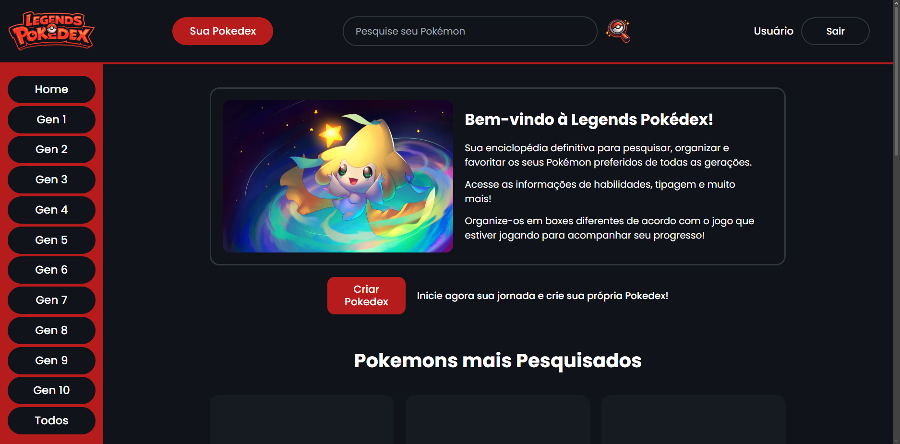
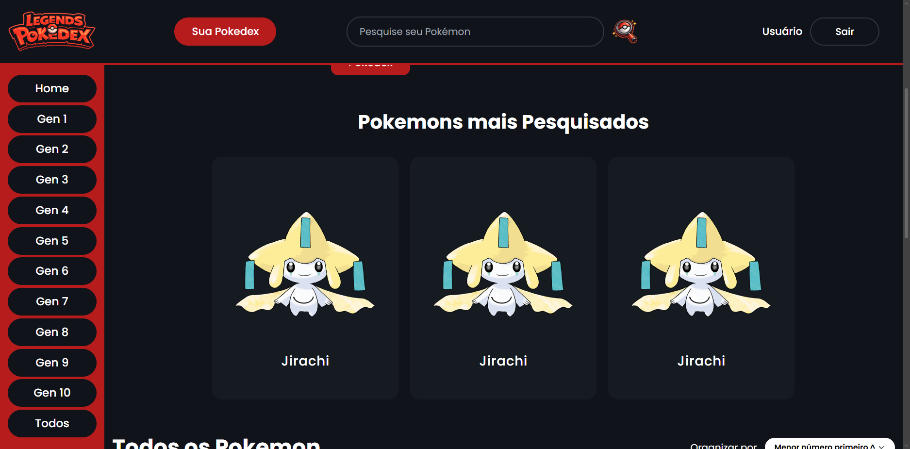
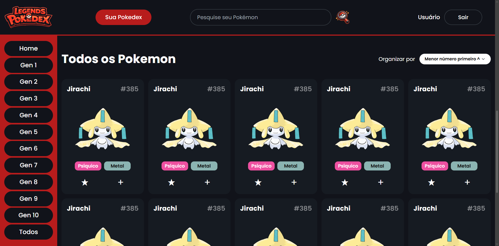
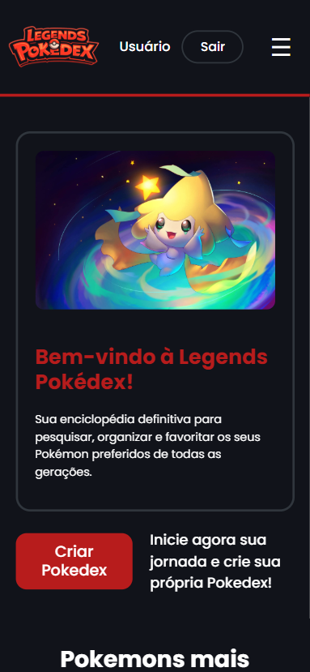
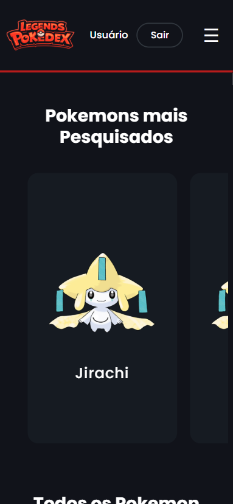
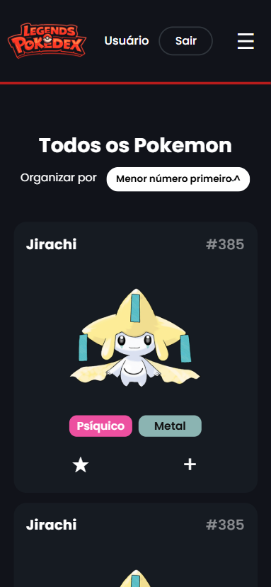

# Trabalho Prático - Semana 6

Nessa atividade, como sempre, vamos evoluir o que foi feito na semana anterior. Fique atento para fazer o projeto da semana anterior e dar sequência nessa jornada.

No trabalho dessa semana vamos alterar o projeto para que a responsividade da home-page seja feita, agora, com o framework Bootstrap.

**IMPORTANTE 1:** Você deve alterar apenas os arquivos **`README.md`**, **`index.html`** e **`styles.css`**, podendo incluir outros arquivos como imagens na pasta **`images`**, caso necessário. Deixe todos os demais arquivos e pastas desse repositório inalterados. **PRESTE MUITA ATENÇÃO NISSO.**

## Informações Gerais

- Nome: Lucas Gomes Esteves Da Silva
- Matricula: 927624
- Proposta de projeto escolhida: Pokedex para Jogadores de Jogos da Franquia Pokémon
- Breve descrição sobre seu projeto: Apresentar informações visuais e organizadas sobre diferentes Pokémon, permitindo visualizar nome, imagem, tipo e número. O projeto também conta com um sistema de login, onde o usuário pode criar a sua Pokédex pessoal e salvar as suas criaturas favoritas.

## Print da versão responsiva com Bootstrap [DESKTOP]

## Print da versão responsiva com Bootstrap [MOBILE] (*)

 